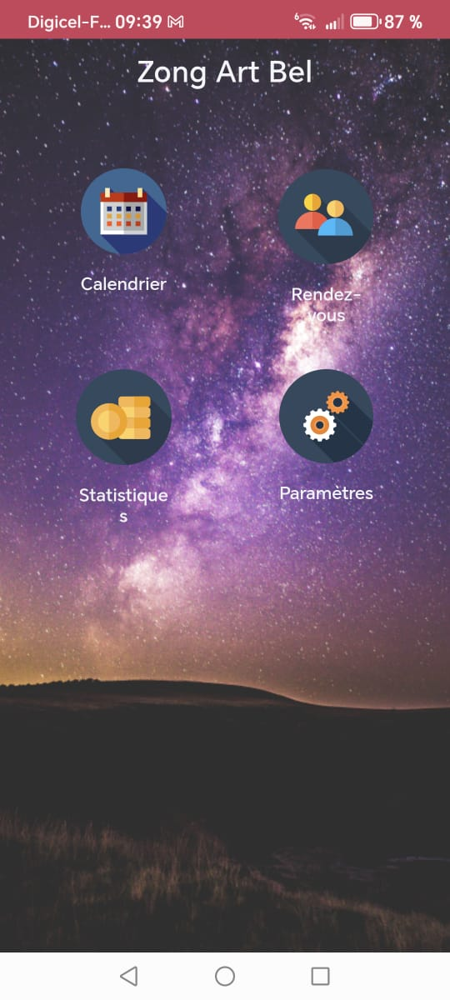
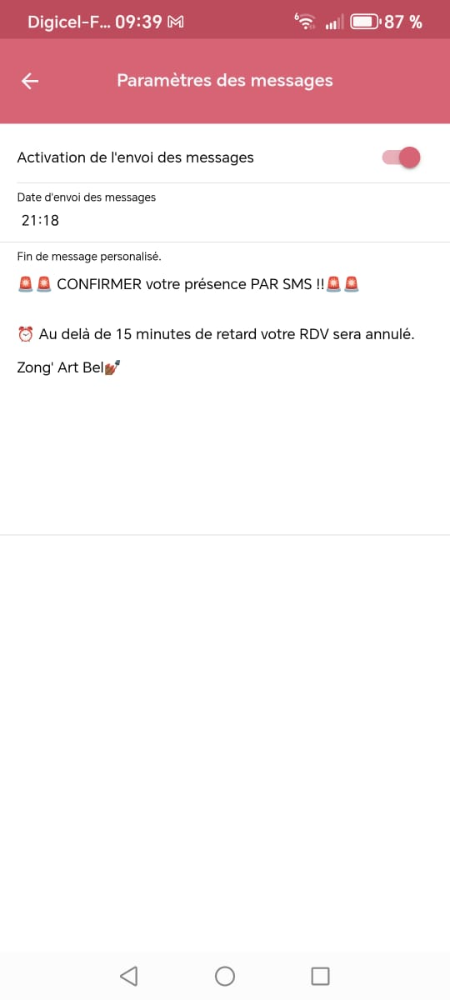
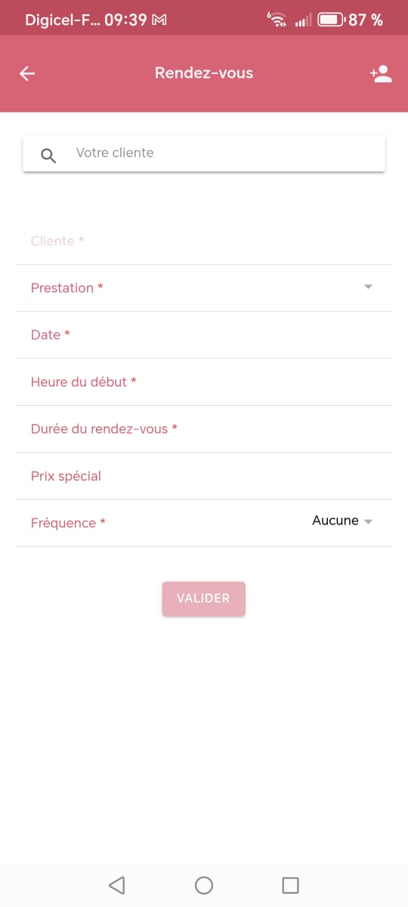
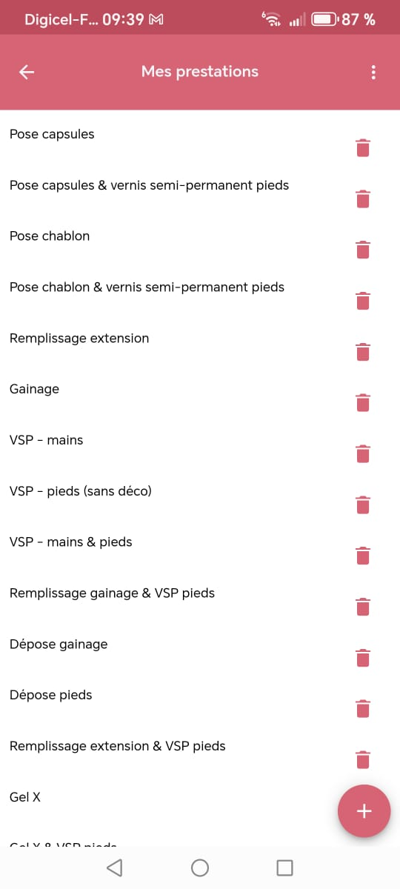

# 💅 NailPro Scheduler (Ionic 4 App)

A mobile application built with Ionic 4 (Android only) to help a nail technician manage her appointments, clients, and services — while staying synced with Google Calendar.
This app is already used in production (V1), and still evolving 🚀.

## 📷 Screenshots

## 📱 Features

- 📆 Appointment booking
Link with Google Calendar to easily manage and sync client appointments.

- 👩‍🎨 Client management
Add, edit, and keep track of clients with their history.

- 💅 Services catalog
Define and manage the different services (nail care, design, etc.).

- 📊 Statistics dashboard
Visualize key metrics (number of appointments, revenue per service, etc.).

- ⚙️ Configuration page
Customize the app settings to fit your workflow.

## 🚧 Project Status

✅ Version 1 already in use in production (by a real nail technician 🎉).
⚙️ Version 2 in progress: improving UX, adding statistics and configuration options.

## 📦 Deployment

The app is packaged and deployed on Android only (APK).
Future improvements may include iOS support.

## 👩‍🎨 Credits

This project was built for a nail technician to manage her business more efficiently.
Special thanks to my sister, the first and most important user ❤️.